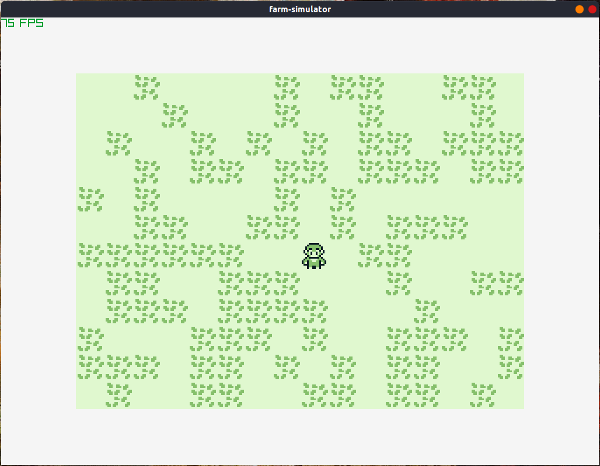

# Farm simulation
Getting used to C again and learning how to develop games from scratch without going all of a sudden in OpenGL API.<br>

## Game features
[WIP]
- Gameboy inspired graphics


<!--  -->

## Dependencies

- [raylib](https://github.com/raysan5/raylib)

## How to install: Ubuntu

- Install raylib dependencies
```
sudo apt install build-essential git cmake
sudo apt install libasound2-dev mesa-common-dev libx11-dev libxrandr-dev libxi-dev xorg-dev libgl1-mesa-dev libglu1-mesa-dev
```

- Install raylib
```
git clone https://github.com/raysan5/raylib.git raylib
cd raylib/src/
make PLATFORM=PLATFORM_DESKTOP RAYLIB_LIBTYPE=SHARED GRAPHICS=GRAPHICS_API_OPENGL_11 -B
sudo make install PLATFORM=PLATFORM_DESKTOP RAYLIB_LIBTYPE=SHARED GRAPHICS=GRAPHICS_API_OPENGL_11 -B
```

- Compile and run game
```
mkdir build
cd build
cmake ../
make
./src/farm-sim
```
